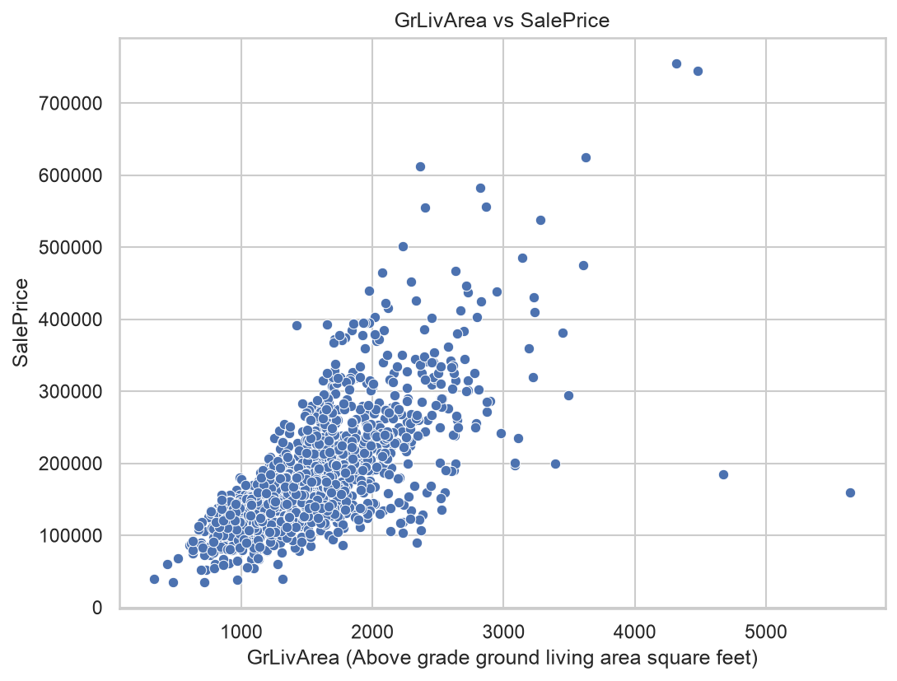

# House Prices: Advanced Regression Techniques

Predictive modeling for house sale prices based on 79 housing features.

## Business Problem

Accurately predicting house sale prices supports real estate valuation, purchase decisions, and mortgage risk assessment. This project builds a machine learning pipeline to predict the final sale price of residential homes in Ames, Iowa, using the Kaggle House Prices dataset.

## Dataset

- **Source**: [Kaggle House Prices: Advanced Regression Techniques](https://www.kaggle.com/competitions/house-prices-advanced-regression-techniques)
- **Size**: 1460 training rows (1458 after removing 2 outliers), 1459 test rows
- **Features**: 79 raw features, expanded to 306 after feature engineering
- **Target**: SalePrice (log1p-transformed to correct right-skewed distribution)

## Key Insights & Performance

- Final model: weighted ensemble of XGBoost + tuned CatBoost (LightGBM's optimal weight converged to ~0 and was effectively dropped)
- Hyperparameters tuned with Optuna across 10-fold cross-validation
- **10-fold CV RMSE (log scale): 0.11059**
- **Kaggle Public Leaderboard score: 0.12616**

*(Insert your best EDA chart here, e.g. SalePrice distribution or correlation heatmap)*



## How to Run

```bash
git clone https://github.com/wz206/House-Prices-Prediction.git
cd House-Prices-Prediction

python3 -m venv venv
source venv/bin/activate
pip install -r requirements.txt

jupyter notebook notebooks/
```

Run notebooks 01 through 07 in order to reproduce the full pipeline:
| Notebook | Purpose |
|---|---|
| 01_eda.ipynb | Exploratory data analysis |
| 02_data_processing.ipynb | Data cleaning |
| 03_feature_engineering.ipynb | Feature engineering |
| 04_baseline_model.ipynb | Baseline model |
| 05_model_tuning.ipynb | XGBoost / LightGBM / CatBoost training & tuning |
| 06_ensemble.ipynb | Weighted ensemble & first submission |
| 07_final_tuning.ipynb | Final hyperparameter tuning & submission |
